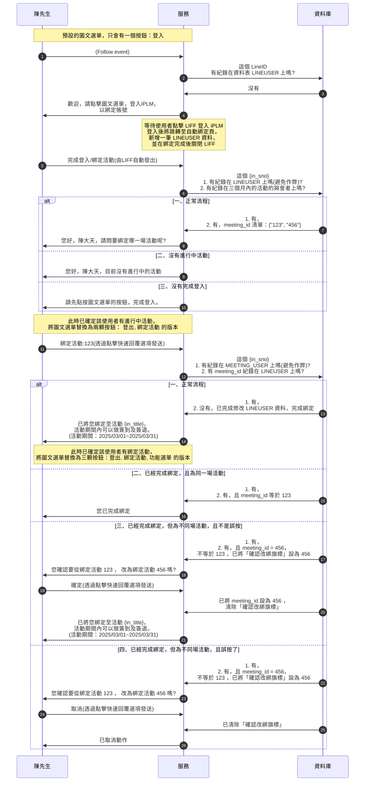

# Line 功能討論 2025-03-10

## 資訊

:::info
DEMO Line Official Account：@693xetnl

:::

## 項目

- [x] 按鈕零：綁定Line，綁定iplm

:::    info
此時已完成綁定 Line ID 與 使用者
:::

- [x] 按鈕一：登入/綁定活動(階段優先目標)
    - 跳到 LIFF 頁面，查詢這個 Line ID 的使用者，有沒有報名資料
    - 如果沒有：很抱歉，系統查無您的報名資料
    - 如果有：列出近三個月的報名資料，包含審核不過的報名()
- [ ] 按鈕二：簽到(階段優先目標)
    - 顯示需要簽到的課程，按了就(去前台網頁簽到/API簽到)
- [ ] 按鈕三：考試(階段目標)
    - 透過網址判斷與會者是誰，直接轉到學員的系統首頁
- [ ] 按鈕四：滿意度
    - 按了就跳出網頁，類似考試，但是填寫滿意度問卷
- [ ] 按鈕五：繳費
    - 按了就跳出網頁，列出這個人現在還沒繳費的繳費單
- [ ] 按鈕六：比賽成績(非優先)
    - 按了就跳出網頁，秀公開查詢頁
- [ ] 按鈕七：上課時間
    - 列出參加課程的上課時間，訊息?

未來規劃：
    - QA自動問答，使用AI解析語意，找有無常見問題可以回應(可以參考 google meet，蝦皮)

## 實際流程

### 情境，第一次加好友，觸發 Follow event ，到完成綁定

# 問答紀錄 2025-03-20

跆協 Line 服務，已完成大部分功能，
還需要協助提供以下具體規格，或操作過程，感謝：

# 登入
- 近三個月的報名資料，如何在正常操作下查詢得到
> Lina：
> 近三個月的報名資料 IN_CLA_MEETING_USER
> 用身分證號查 IN_CLA_MEETING.in_meeting_type 為 seminar(講習)
> in_sno = 身分證號 (被報名的學員)
> 報名時間是 in_regtime

# Line 按鈕
- [課程].[選項時程].[功能項] 與 以下兩功能的對應
> Lina：
> 簽到，要先查 IN_CLA_MEETING_FUNTIONTIME
> 簽到簽退 in_meeting_action = 2
> 功能選項開放 - 簽到簽退 的起迄時間落在當前時間

# 簽到
- 簽到網頁網址
> Lina：
> 
> 
> 
> 
> 這個功能應該是我三年前寫的，但不知道Elsa有沒有在用，她可能用的是舊的 b.aspx 那種
> 因為她經常回報大塞車，api 基本不會塞車，除非她用 b.aspx 系列或 c.aspx
> 簽到簽退獨立一個頁面 學員登入是另外一個頁面
> 簽到簽退不用學員登入，場景有兩種，學員LINE收到網址，點入網頁，輸入自己的身分證號 > 簽到成功
> 還有一種不在開發範圍，是講師/助理在教室門口，掃學員的身分證QrCode，簽到成功

# 考試
- 考試網頁網址

# 測試資料
- 測試用課程網址